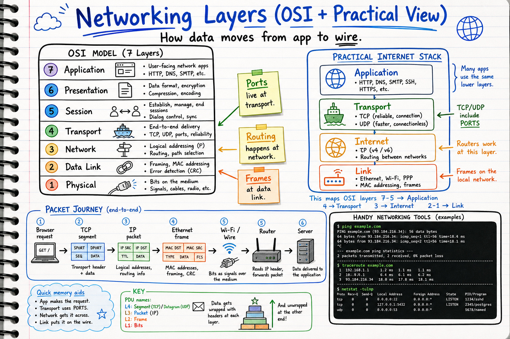
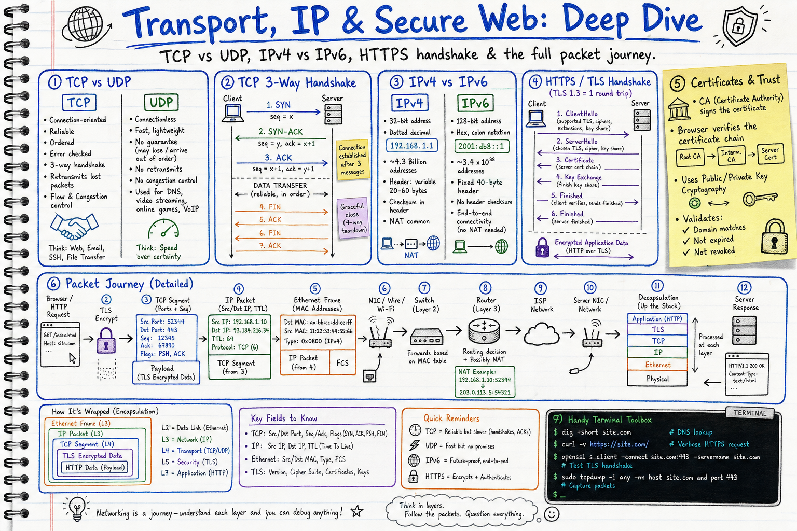

# OSI & Networking Visual Notes

Sketchbook-style visual learning notes for networking fundamentals.

## Diagrams

### 1. Networking Layers (OSI + Practical View)

Covers:
- The 7 OSI layers (Application → Physical) with concise bullets per layer
- Practical internet stack mapping (Application, Transport, Internet, Link)
- Where ports, routing, and frames live
- High-level packet journey: Browser → TCP → IP → Ethernet → Wire → Router → Server
- Handy commands: `ping`, `traceroute`, `netstat`

### 2. Transport, IP & Secure Web: Deep Dive

Covers:
- **TCP vs UDP**: reliability, ordering, use cases
- **TCP 3-way handshake**: SYN → SYN-ACK → ACK, plus teardown
- **IPv4 vs IPv6**: address size, format, NAT differences
- **HTTPS / TLS handshake**: ClientHello → ServerHello → Certificate → key exchange → encrypted data
- **Certificates & trust**: CA signing, chain verification, public/private keys
- **Detailed packet journey**: header encapsulation across layers (HTTP → TLS → TCP → IP → Ethernet → wire → router/NAT → server) and decapsulation
- Handy commands: `dig`, `curl -v`, `openssl s_client`, `tcpdump`

## Style

Both diagrams follow the repository's sketchbook visual style. See:
- `docs/sketchbook-style-guide.md`
- `docs/system-design-note-template.md`
